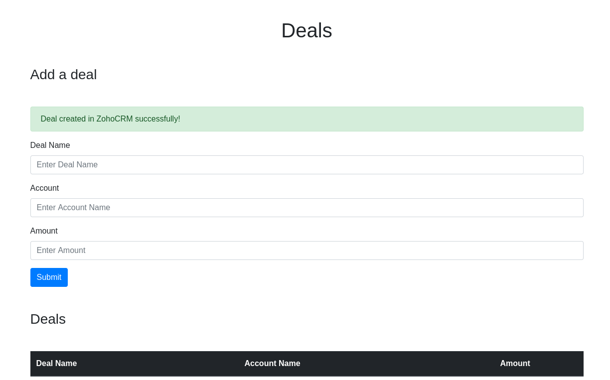

# Zoho CRM integration on Laravel

The simple integration with [Zoho](https://www.zoho.com/crm/) CRM using framework [Laravel](https://laravel.com/)

## Requirements

- php ^7.0|^8.0
- laravel ^6|^7|^8

## Quick start

- To register an account in [Zoho](https://www.zoho.com/crm/)
- To register your an application in [Api Console Zoho](https://api-console.zoho.com/) and choose server-based application

## TODO

- Replace curl on guzzle library
- Make unit tests

## License

The Laravel framework is open-sourced software licensed under the MIT license.

